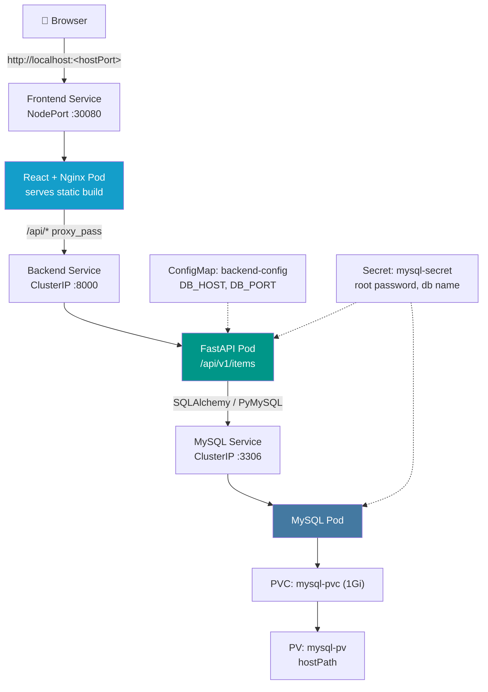
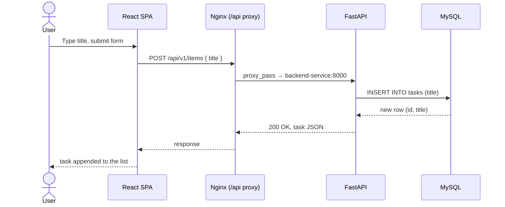

<div align="center">

# 🧱 Three-Tier Task Manager on Kubernetes

**React → FastAPI → MySQL, fully containerized and deployed on Kubernetes (kind).**


A small Task Manager app used as a hands-on reference for **containerizing a multi-tier app and deploying it to Kubernetes** — Deployments, Services, ConfigMaps, Secrets, and PV/PVC, all wired together.

</div>

---

## 📑 Table of Contents

- [Overview](#-overview)
- [Tech Stack](#-tech-stack)
- [Architecture](#-architecture)
- [Request Flow](#-request-flow-create-a-task)
- [Folder Structure](#-folder-structure)
- [API Reference](#-api-reference)
- [Getting Started](#-getting-started)
  - [Option A — Docker Compose (local dev)](#option-a--docker-compose-local-dev)
  - [Option B — Kubernetes with kind](#option-b--kubernetes-with-kind)
- [Environment Variables](#-environment-variables)
- [Useful Commands](#-useful-commands)
- [Known Issues](#-known-issues--things-worth-fixing)
- [Roadmap](#-roadmap)
- [License](#-license)

---

## 📖 Overview

The app is a minimal task manager: add a task, view the list, delete a task. That's it — the point isn't the feature set, it's the **infrastructure around it**:

- **Frontend** — React (Vite) SPA, built into static files and served by Nginx. Nginx also reverse-proxies `/api/*` to the backend so the browser only ever talks to one origin.
- **Backend** — FastAPI, layered into `api / core / models / schemas`, talking to MySQL via SQLAlchemy + PyMySQL.
- **Database** — MySQL 8, with schema created automatically on backend startup (`Base.metadata.create_all`).
- **Runtime** — every tier has its own Dockerfile. `docker-compose.yml` runs all three locally; the `K8s/` manifests run the same three tiers as a real cluster workload (Deployments + Services + ConfigMap + Secret + PV/PVC).

---

## 🧰 Tech Stack

| Layer | Technology |
|---|---|
| Frontend | React 19 + Vite, Axios |
| Web server (frontend) | Nginx (reverse proxy to backend) |
| Backend | FastAPI + SQLAlchemy + PyMySQL, Uvicorn |
| Database | MySQL 8 |
| Containerization | Docker (multi-stage build for frontend) |
| Local orchestration | Docker Compose |
| Cluster orchestration | Kubernetes (tested with `kind`) |
| Config / secrets | ConfigMap + Secret |
| Persistence | PersistentVolume + PersistentVolumeClaim (hostPath) |

---

## 🏗 Architecture



All three tiers run inside the `task-manager` namespace. Frontend is the only component exposed outside the cluster (NodePort); backend and MySQL are `ClusterIP`-only — the frontend can't be bypassed to hit the database directly, which is the right call.

---

## 🔁 Request Flow (create a task)



Delete follows the same path: `DELETE /api/v1/items/{id}` → 404 if the task doesn't exist, otherwise the row is removed and the UI drops it from state.

---

## 📁 Folder Structure

```text
.
├── K8s/
│   ├── namespace.yml
│   ├── backend/
│   │   ├── ConfigMap.yml
│   │   ├── deployment.yml
│   │   └── service.yml
│   ├── frontend/
│   │   ├── deployment.yml
│   │   └── service.yml
│   └── mysql/
│       ├── deployment.yml
│       ├── service.yml
│       ├── secret.yml
│       ├── pv.yml
│       └── pvc.yml
│
├── backend/
│   ├── Dockerfile
│   ├── requirements.txt
│   └── app/
│       ├── main.py                  # FastAPI app, CORS, /health
│       ├── dependencies.py          # DB session dependency
│       ├── core/
│       │   └── database.py          # engine, SessionLocal, Base
│       ├── models/
│       │   └── task.py              # SQLAlchemy Task model
│       ├── schemas/
│       │   └── task.py              # Pydantic TaskCreate / TaskResponse
│       └── api/v1/
│           ├── router.py
│           └── endpoints/
│               └── items.py         # GET / POST / DELETE /items
│
├── frontend/
│   ├── Dockerfile                   # multi-stage: node build → nginx serve
│   ├── nginx.conf                   # static files + /api reverse proxy
│   └── src/
│       ├── main.jsx / App.jsx
│       ├── pages/Home.jsx
│       ├── components/tasks/        # TaskForm, TaskList, TaskCard
│       ├── hooks/useTasks.js        # fetch/add/delete state logic
│       ├── services/                # apiClient.js, taskService.js
│       └── constants/api.js
│
├── docker-compose.yml
└── README.md
```

> ⚠️ Note the real casing: it's `K8s/`, not `k8s/`, and the manifests are `.yml`, not `.yaml`. Every `kubectl apply -f k8s/...` command floating around in older docs for this repo will fail on a case-sensitive filesystem — the commands below use the actual paths.

---

## 🔌 API Reference

Base path: `/api/v1`

| Method | Endpoint | Body | Description |
|---|---|---|---|
| GET | `/health` | — | Liveness/readiness check, returns `{"status": "healthy"}` |
| GET | `/api/v1/items` | — | List all tasks |
| POST | `/api/v1/items` | `{ "title": string }` | Create a task |
| DELETE | `/api/v1/items/{id}` | — | Delete a task by id, `404` if missing |

There's no update/edit endpoint currently — tasks are create-or-delete only.

---

## 🚀 Getting Started

### Prerequisites

- Docker
- For Kubernetes: `kubectl` and `kind`

### Option A — Docker Compose (local dev)

> ⚠️ **Current limitation:** `frontend/nginx.conf` proxies to `http://backend-service:8000` — a hostname that only resolves inside Kubernetes (it's the K8s `Service` name). Compose's internal DNS resolves by **compose service key** instead (`backend`, not `backend-service`), so **as currently configured, the frontend container fails to start under Compose** (`nginx: [emerg] host not found in upstream "backend-service"`). This was a deliberate tradeoff made while focusing on the Kubernetes deployment path — see [Known Issues](#-known-issues--things-worth-fixing) for the proper long-term fix. To run Compose locally right now, temporarily change that line to `proxy_pass http://backend:8000;` and rebuild.

The compose file expects two env files that are **gitignored on purpose** (they hold DB credentials) — create them yourself first, using exact `KEY=VALUE` syntax (not `KEY: VALUE` — that's YAML syntax, and Compose's env file parser silently fails to pick it up):

```bash
# backend/.env.backend
DB_HOST=mysql
DB_PORT=3306
DB_USER=root
DB_PASSWORD=choose-a-password
DB_NAME=task_manager
```

```bash
# .env.db  (repo root)
MYSQL_ROOT_PASSWORD=choose-a-password   # must match DB_PASSWORD above, character-for-character
MYSQL_DATABASE=task_manager
```

`docker-compose.yml`'s `mysql` service also needs a healthcheck so the backend actually waits for MySQL to accept connections instead of racing it on first boot:

```yaml
mysql:
  image: mysql:8
  container_name: task-manager-mysql
  ports:
    - "3306:3306"
  env_file:
    - .env.db
  volumes:
    - mysql_data:/var/lib/mysql
  healthcheck:
    test: ["CMD", "mysqladmin", "ping", "-h", "localhost"]
    interval: 5s
    timeout: 5s
    retries: 10
    start_period: 10s
  restart: unless-stopped

backend:
  build:
    context: ./backend
  container_name: task-manager-backend
  ports:
    - "8000:8000"
  env_file:
    - ./backend/.env.backend
  depends_on:
    mysql:
      condition: service_healthy   # waits for the healthcheck above, not just "container started"
  restart: unless-stopped
```

Then:

```bash
git clone https://github.com/ArshadKhan-007/Three-Tier-Kubernetes-App.git
cd Three-Tier-Kubernetes-App
docker compose down -v          # if re-running: wipe any stale mysql volume first —
                                 # MySQL only reads MYSQL_ROOT_PASSWORD on first init,
                                 # a leftover volume silently ignores new env files
docker compose up --build
```

- Frontend → http://localhost:3000
- Backend → http://localhost:8000/docs (Swagger UI)
- Sanity check: `curl http://localhost:8000/health` → `{"status":"healthy"}`

### Option B — Kubernetes with kind

`kind` does **not** expose NodePort services to your host by default — you need a cluster config with an explicit port mapping, or the app will deploy fine and still be unreachable.

```yaml
# kind-config.yml
kind: Cluster
apiVersion: kind.x-k8s.io/v1alpha4
nodes:
  - role: control-plane
    extraPortMappings:
      - containerPort: 30080   # must match nodePort in K8s/frontend/service.yml — do not change
        hostPort: 30080        # the port YOU access on localhost — change this to whatever you like (e.g. 3001)
        protocol: TCP
```

> `containerPort` and `hostPort` are not the same thing. `containerPort` has to stay `30080` because that's the `nodePort` hardcoded in `K8s/frontend/service.yml` — that's the fixed end of the chain. `hostPort` is just where *you* want it reachable on your machine; set it to `3001`, `8080`, whatever's free. If your `kind-config.yml` has `hostPort: 3001`, then the app is at `http://localhost:3001`, not `:30080` — the example below uses `30080` for both since that's the default, but swap in your actual `hostPort` value.

```bash
kind create cluster --name three-tier --config kind-config.yml
kubectl cluster-info
```

Deploy in order (mysql before backend, backend before frontend — nothing here waits on readiness across resources):

```bash
kubectl apply -f K8s/namespace.yml
kubectl apply -f K8s/mysql/
kubectl apply -f K8s/backend/
kubectl apply -f K8s/frontend/
```

Watch it come up:

```bash
kubectl get pods -n task-manager -w
```

Once everything is `Running`, open **http://localhost:\<your hostPort\>** — `http://localhost:30080` only if you kept the default; check your own `kind-config.yml` if you changed it.

Didn't set up the port mapping, or on a cluster where NodePort isn't reachable? Fall back to port-forwarding:

```bash
kubectl port-forward svc/frontend-service 3000:80 -n task-manager
# → http://localhost:3000
```

---

## 🔐 Environment Variables

### Backend (`backend/app/core/database.py`)

| Variable | Default | Used for |
|---|---|---|
| `DB_HOST` | `localhost` | MySQL host |
| `DB_PORT` | `3306` | MySQL port |
| `DB_USER` | `xyz` | MySQL user |
| `DB_PASSWORD` | `RtabcPass` | MySQL password |
| `DB_NAME` | `task_manager` | MySQL database name |

In Kubernetes, `DB_HOST`/`DB_PORT` come from the `backend-config` ConfigMap, and `DB_PASSWORD`/`DB_NAME` come from the `mysql-secret` Secret. `DB_USER` is hardcoded to `root` directly in `K8s/backend/deployment.yml`.

---

## 🛠 Useful Commands

```bash
# Pods / services / deployments
kubectl get pods -n task-manager
kubectl get svc -n task-manager
kubectl get deployments -n task-manager

# Logs
kubectl logs -f deployment/backend -n task-manager
kubectl logs -f deployment/frontend -n task-manager

# Shell into a pod
kubectl exec -it deployment/backend -n task-manager -- /bin/bash

# Tear down
kubectl delete -f K8s/frontend/
kubectl delete -f K8s/backend/
kubectl delete -f K8s/mysql/
kubectl delete -f K8s/namespace.yml
kind delete cluster --name three-tier
```

---

## ⚠️ Known Issues / Things Worth Fixing

Called out plainly, since this repo is being used to demonstrate DevOps chops and an interviewer will spot these in about thirty seconds. Split by status so it's clear what's actually been dealt with vs. what's still sitting there.

### ✅ Resolved (found and fixed during local debugging)

1. **`.env.db` used YAML syntax (`KEY: VALUE`) instead of env-file syntax (`KEY=VALUE`).** Compose's env-file parser doesn't error on this — it just silently doesn't set the variable. Fixed by switching to `=`.
2. **Root password mismatch between `.env.db` and `backend/.env.backend`.** MySQL sets its real root password from `MYSQL_ROOT_PASSWORD` only on first init; the backend has to match it exactly or every query fails with `1045 Access denied`. Fixed by aligning both values.
3. **Stale Docker volume masked the two issues above.** `mysql_data` had already been initialized by an earlier run, so new env files had zero effect until the volume was wiped with `docker compose down -v`. Worth remembering any time a "fix" to an env file doesn't seem to change behavior — check for a stale volume before assuming the fix is wrong.
4. **`frontend/nginx.conf` had a stray shell command pasted into it** — `location /api/ {kubectl logs $(kubectl get pod ...)` — which made Nginx refuse to start (`unknown directive "kubectl"`). Fixed by removing the pasted text.
5. **No readiness gate between MySQL and the backend in Compose.** `depends_on: mysql` only waits for the container to *start*, not for MySQL to actually accept connections, so the backend hit `Connection refused` on first boot. Fixed by adding a `healthcheck` to the `mysql` service and `depends_on.mysql.condition: service_healthy` on the backend.

### 🚧 Open

6. **`frontend/nginx.conf` currently hardcodes `backend-service`** (the Kubernetes Service name), which means **it does not resolve under Docker Compose** (Compose uses the service key `backend` instead). This is a real environment-coupling problem: the same image can't currently serve both deployment targets. Proper fix is an Nginx config *template* (`default.conf.template`) with `proxy_pass http://${BACKEND_HOST}:8000;`, using the image's built-in `envsubst` entrypoint hook, and passing `BACKEND_HOST=backend` in Compose vs. `BACKEND_HOST=backend-service` in the K8s Deployment.
7. **`K8s/mysql/secret.yml` has a hardcoded, committed credential.** Base64 is encoding, not encryption — `MYSQL_ROOT_PASSWORD` decodes straight to `rootpassword`. Committing real (or real-looking) secrets to git is one of the first things reviewers flag. Move it to a value injected at deploy time (`kubectl create secret` imperatively, Sealed Secrets, SOPS, or an external secrets manager), and rotate it since it's now public in this repo's history.
8. **Backend connects to MySQL as `root`.** Works, but it's not least-privilege. A dedicated `task_manager_app` user scoped to just that database is the correct setup for anything beyond a demo.
9. **`frontend/src/app.jsx` is an empty duplicate of `App.jsx`.** Harmless on Linux, but a landmine on case-insensitive filesystems (macOS/Windows) where git can end up tracking two entries for what the OS sees as one file. Delete it.
10. **No readiness gate between tiers in Kubernetes either** — same class of race as issue #5, just not yet fixed on the K8s side. The backend's `readinessProbe` checks its own `/health`, not whether MySQL is reachable.
11. **No update endpoint.** Tasks can be created and deleted but not edited — fine for a demo, worth mentioning if the API is presented as complete.

---

## 🗺 Roadmap

- [ ] Ingress controller instead of raw NodePort
- [ ] Horizontal Pod Autoscaler
- [ ] Helm chart (replace the raw manifests)
- [ ] CI/CD (build, scan, push, deploy)
- [ ] Externalized secrets management
- [ ] Prometheus + Grafana monitoring
- [ ] TLS termination

---

## 📄 License

No license file is currently included in this repository — treat it as **all rights reserved** by default until one is added. If the intent is for others to freely use/modify this (which is reasonable for a learning project), add an explicit `LICENSE` file (MIT is the standard low-friction choice for this kind of project).
